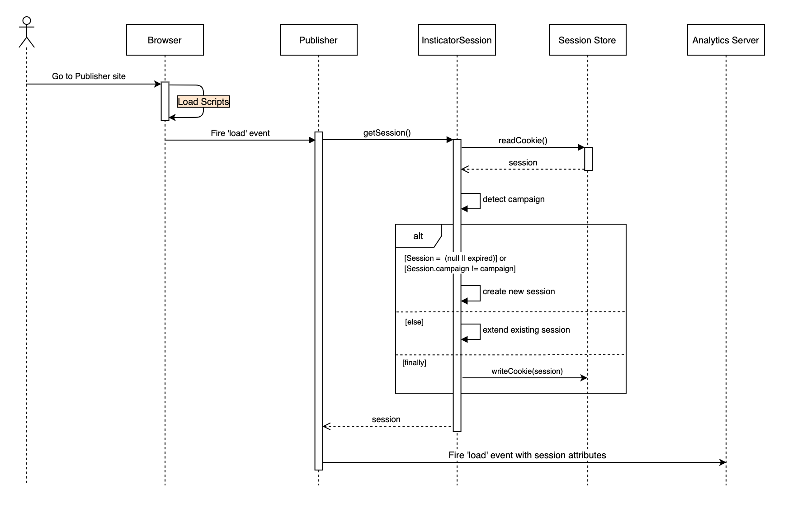

# Functional Requirements

1. As a publisher, I am able to use InsticatorSession to create user sessions in the browser, so that I can access them for internal tracking purposes and correlate them to analytics events. Sessions should include critical user identifiers. Namely, a unique session ID, the referring website the user navigated from, and the campaign type associated with the user's session. Sessions should be extended or expired only on discrete calls, so that I can determine what is a valid user interaction for session extension purposes.
2. As a publisher, I need sessions to expire after a reasonable amount of time of inactivity, so that there is minimal risk of innacurately representing the user's experience if they make multiple visits to my site without closing the browser in between visits.
3. As a publisher, I need sessions to have a one to one relationship with days, so that sessions fit our exisitng reporting structures. No session should be able to span two days.
4. As a publisher, I need sessions to be distinct for each campaign type, regardless of any other factor such as time or referrer, so that we can ensure accurate user funneling.

# Architecture

### <ins>Initial Page Load Sequence Diagram</ins>

# Assumptions

- The explicit instruction to make use of cookies here is not to be conflated with the expectation that they will be used to augment reporting calls directly (without an explicit call to getSession prior to external calls, the session information would be inaccurate) and instead are a implementation detail for a form of local storage. Of course, as long as getSession is called in advance of reporting calls and those calls are to the same domain that served the page, then they would be available. However, since the cookies are being created client side, one would assume the anticipated target for any telemetry is intended to be agnostic.
- Expanding on that assumption is the expectation that this is either a plumbing command for an expanded analytics platform, or intended to always be discretely called by a publisher managing their own telemetry. Such that relying solely on the cookies themselves to be delivered as headers during event reporting would be impossible to implement. Still, the cookies are set to sameSite: lax (new default) and secure:true, which means they are always available to an api served from the same domain and with valid TSL certs.
- The id and date formats specified in the example are approximations. In the case of the date, it's very nearly the syntax for an ISO string but would require either something like Moment.js (not small) or a fair bit of rejiggering with the native Date function in order convert back and forth. I'm assuming using the native ISOString method is allowed.

# Security

- Using session cookies generated and updated on the client makes any form of encryption (such as private/public key) largely an exercise in futility for preventing a determined attacker from accessing or editing session data.
- The additional security of something like the httpOnly header is similarly not available and allows any 3rd party script to potentially abuse the session token. However, in both cases, it's worth remembering that these are not authenticated sessions and are not intended to be used as identifiers by internal resources that would be compromised by an XSS, MitM , or session fixation attack. (To that effect, I would prefer to use local or session storage over cookies in a real implementation whenever possible (GA allows for storage mechanism as a configuration option I believe)).

# Improvements

- Treating different referrer source as trigger for new campaign.
- Handling multiple tabs in the same browser session. Current behavior may lead to a number of extra sessions being generated if user toggles back and forth.
- Handling case of someone traveling across timezones while a session is active, such that they may advance the clock to end a session prematurely.
- Handling daylight savings time clock changes during an active session.
- Allow custom configuration. Things such as storage key, campaign key, session length, etc. Either by refactoring to require instantiating the library with config, or by attaching config object to global scope for library detection.
- Allowing for support for subdomains (preferably optionally, and preferably discretely) so that a publisher can determine the extent to which they want to share sessions across a subset of their properties.

# Testing

- Units tests have been provided but this library also lends itself relatively well to automated testing with a tool like cypress, where we don't have to rely on mocking browser storage or URLs and can inspect the generated cookies.
